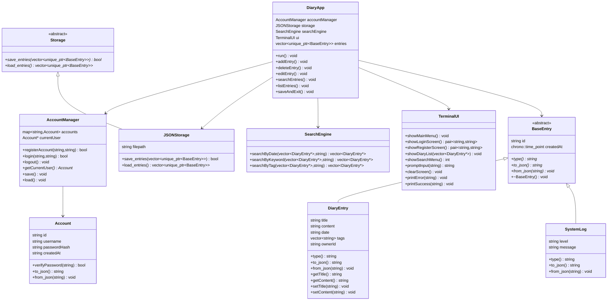
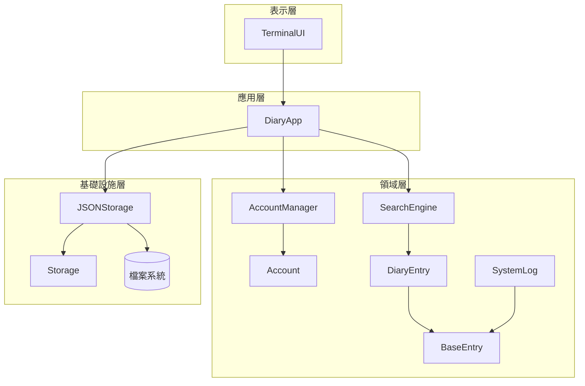
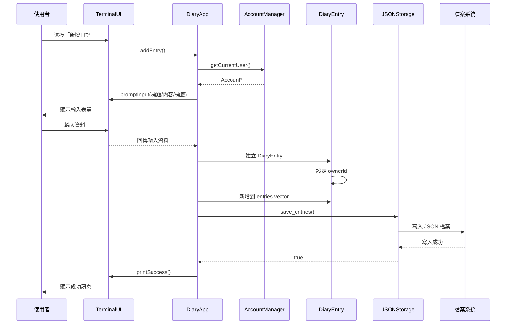
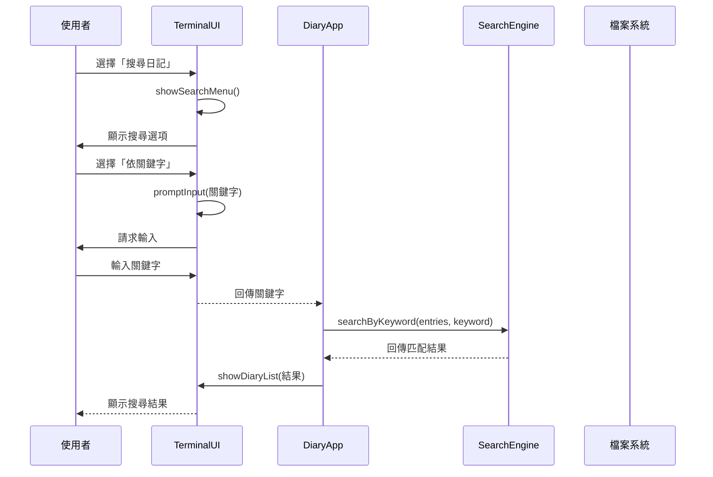
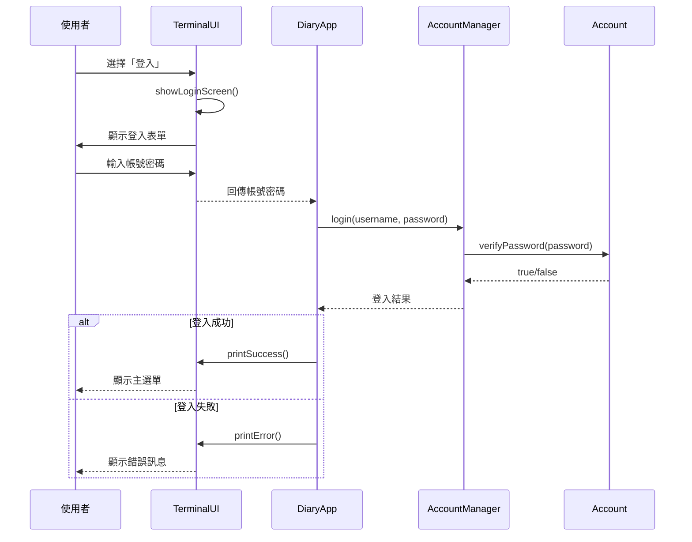
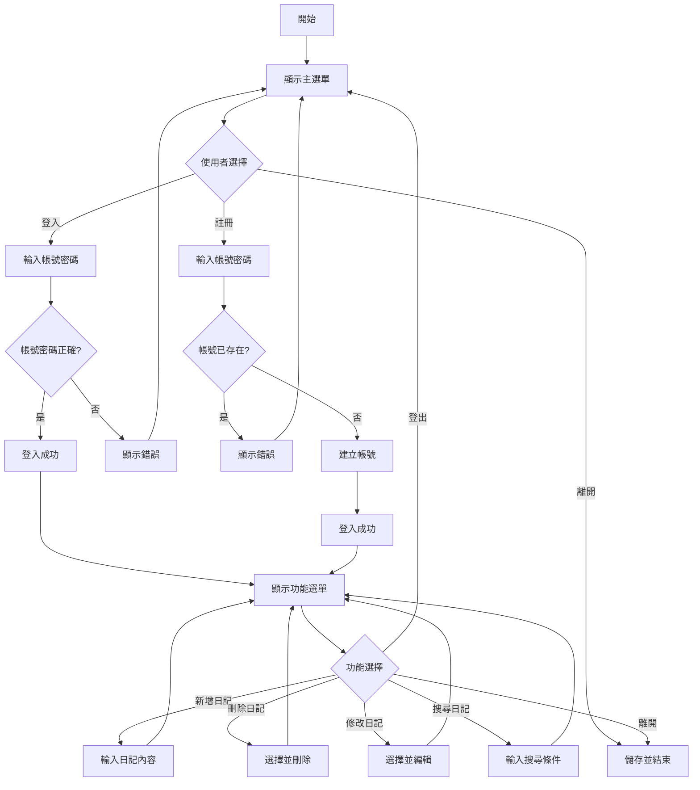
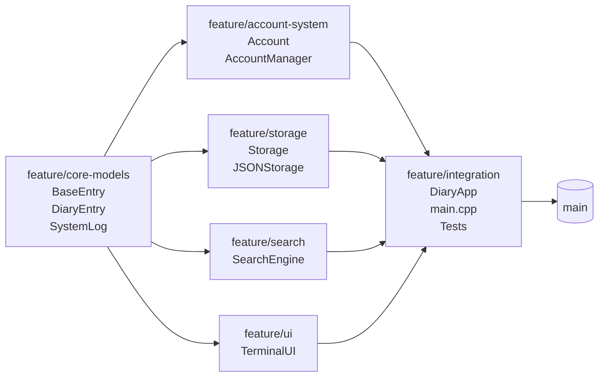

# 系統圖表

## 1. 類別圖

```mermaid
classDiagram
    class BaseEntry {
        <<abstract>>
        string id
        chrono::time_point createdAt
        +type() string*
        +to_json() string*
        +from_json(string) void*
        +~BaseEntry() void
    }

    class DiaryEntry {
        string title
        string content
        string date
        vector~string~ tags
        string ownerId
        +type() string
        +to_json() string
        +from_json(string) void
        +getTitle() string
        +getContent() string
        +setTitle(string) void
        +setContent(string) void
    }

    class SystemLog {
        string level
        string message
        +type() string
        +to_json() string
        +from_json(string) void
    }

    class Account {
        string id
        string username
        string passwordHash
        string createdAt
        +verifyPassword(string) bool
        +to_json() string
        +from_json(string) void
    }

    class AccountManager {
        map~string,Account~ accounts
        Account* currentUser
        +registerAccount(string,string) bool
        +login(string,string) bool
        +logout() void
        +getCurrentUser() Account*
        +save() void
        +load() void
    }

    class Storage {
        <<abstract>>
        +save_entries(vector~unique_ptr~BaseEntry~~) bool*
        +load_entries() vector~unique_ptr~BaseEntry~~*
    }

    class JSONStorage {
        string filepath
        +save_entries(vector~unique_ptr~BaseEntry~~) bool
        +load_entries() vector~unique_ptr~BaseEntry~~
    }

    class SearchEngine {
        +searchByDate(vector~DiaryEntry*~,string) vector~DiaryEntry*~
        +searchByKeyword(vector~DiaryEntry*~,string) vector~DiaryEntry*~
        +searchByTag(vector~DiaryEntry*~,string) vector~DiaryEntry*~
    }

    class TerminalUI {
        +showMainMenu() void
        +showLoginScreen() pair~string,string~
        +showRegisterScreen() pair~string,string~
        +showDiaryList(vector~DiaryEntry*~) void
        +showSearchMenu() int
        +promptInput(string) string
        +clearScreen() void
        +printError(string) void
        +printSuccess(string) void
    }

    class DiaryApp {
        AccountManager accountManager
        JSONStorage storage
        SearchEngine searchEngine
        TerminalUI ui
        vector~unique_ptr~BaseEntry~~ entries
        +run() void
        +addEntry() void
        +deleteEntry() void
        +editEntry() void
        +searchEntries() void
        +listEntries() void
        +saveAndExit() void
    }

    BaseEntry <|-- DiaryEntry
    BaseEntry <|-- SystemLog
    Storage <|-- JSONStorage
    DiaryApp --> AccountManager
    DiaryApp --> JSONStorage
    DiaryApp --> SearchEngine
    DiaryApp --> TerminalUI
    DiaryApp --> BaseEntry
    AccountManager --> Account
```

## 2. 架構圖

```mermaid
graph TB
    subgraph Presentation["表示層"]
        UI[TerminalUI]
    end

    subgraph Application["應用層"]
        APP[DiaryApp]
    end

    subgraph Domain["領域層"]
        SE[SearchEngine]
        AM[AccountManager]
        AC[Account]
        DE[DiaryEntry]
        SL[SystemLog]
        BE[BaseEntry]
    end

    subgraph Infrastructure["基礎設施層"]
        JS[JSONStorage]
        ST[Storage]
        FS[(檔案系統)]
    end

    UI --> APP
    APP --> SE
    APP --> AM
    APP --> JS
    AM --> AC
    SE --> DE
    JS --> FS
    DE --> BE
    SL --> BE
    JS --> ST
```

## 3. 循序圖 — 新增日記

```mermaid
sequenceDiagram
    participant U as 使用者
    participant UI as TerminalUI
    participant App as DiaryApp
    participant AM as AccountManager
    participant DE as DiaryEntry
    participant JS as JSONStorage
    participant FS as 檔案系統

    U->>UI: 選擇「新增日記」
    UI->>App: addEntry()
    App->>AM: getCurrentUser()
    AM-->>App: Account*
    App->>UI: promptInput(標題/內容/標籤)
    UI->>U: 顯示輸入表單
    U->>UI: 輸入資料
    UI-->>App: 回傳輸入資料
    App->>DE: 建立 DiaryEntry
    DE->>DE: 設定 ownerId
    App->>DE: 新增到 entries vector
    App->>JS: save_entries()
    JS->>FS: 寫入 JSON 檔案
    FS-->>JS: 寫入成功
    JS-->>App: true
    App->>UI: printSuccess()
    UI-->>U: 顯示成功訊息
```

## 4. 循序圖 — 搜尋日記

```mermaid
sequenceDiagram
    participant U as 使用者
    participant UI as TerminalUI
    participant App as DiaryApp
    participant SE as SearchEngine
    participant FS as 檔案系統

    U->>UI: 選擇「搜尋日記」
    UI->>UI: showSearchMenu()
    UI->>U: 顯示搜尋選項
    U->>UI: 選擇「依關鍵字」
    UI->>UI: promptInput(關鍵字)
    UI->>U: 請求輸入
    U->>UI: 輸入關鍵字
    UI-->>App: 回傳關鍵字
    App->>SE: searchByKeyword(entries, keyword)
    SE-->>App: 回傳匹配結果
    App->>UI: showDiaryList(結果)
    UI-->>U: 顯示搜尋結果
```

## 5. 循序圖 — 登入流程

```mermaid
sequenceDiagram
    participant U as 使用者
    participant UI as TerminalUI
    participant App as DiaryApp
    participant AM as AccountManager
    participant AC as Account

    U->>UI: 選擇「登入」
    UI->>UI: showLoginScreen()
    UI->>U: 顯示登入表單
    U->>UI: 輸入帳號密碼
    UI-->>App: 回傳帳號密碼
    App->>AM: login(username, password)
    AM->>AC: verifyPassword(password)
    AC-->>AM: true/false
    AM-->>App: 登入結果
    alt 登入成功
        App->>UI: printSuccess()
        UI-->>U: 顯示主選單
    else 登入失敗
        App->>UI: printError()
        UI-->>U: 顯示錯誤訊息
    end
```

## 6. 登入流程圖

```mermaid
flowchart TD
    A[開始] --> B[顯示主選單]
    B --> C{使用者選擇}
    C -->|登入| D[輸入帳號密碼]
    C -->|註冊| E[輸入帳號密碼]
    C -->|離開| Z[儲存並結束]
    D --> F{帳號密碼正確?}
    F -->|是| G[登入成功]
    F -->|否| H[顯示錯誤]
    H --> B
    E --> I{帳號已存在?}
    I -->|是| J[顯示錯誤]
    J --> B
    I -->|否| K[建立帳號]
    K --> L[登入成功]
    G --> M[顯示功能選單]
    L --> M
    M --> N{功能選擇}
    N -->|新增日記| O[輸入日記內容]
    N -->|刪除日記| P[選擇並刪除]
    N -->|修改日記| Q[選擇並編輯]
    N -->|搜尋日記| R[輸入搜尋條件]
    N -->|登出| B
    N -->|離開| Z
    O --> M
    P --> M
    Q --> M
    R --> M
```

## 7. 開發迭代流程圖

```mermaid
graph LR
    S1[feature/core-models<br/>BaseEntry<br/>DiaryEntry<br/>SystemLog]
    S2[feature/account-system<br/>Account<br/>AccountManager]
    S3[feature/storage<br/>Storage<br/>JSONStorage]
    S4[feature/search<br/>SearchEngine]
    S5[feature/ui<br/>TerminalUI]
    S6[feature/integration<br/>DiaryApp<br/>main.cpp<br/>Tests]
    MAIN[(main)]

    S1 --> S2
    S1 --> S3
    S1 --> S4
    S1 --> S5
    S2 --> S6
    S3 --> S6
    S4 --> S6
    S5 --> S6
    S6 --> MAIN
```
